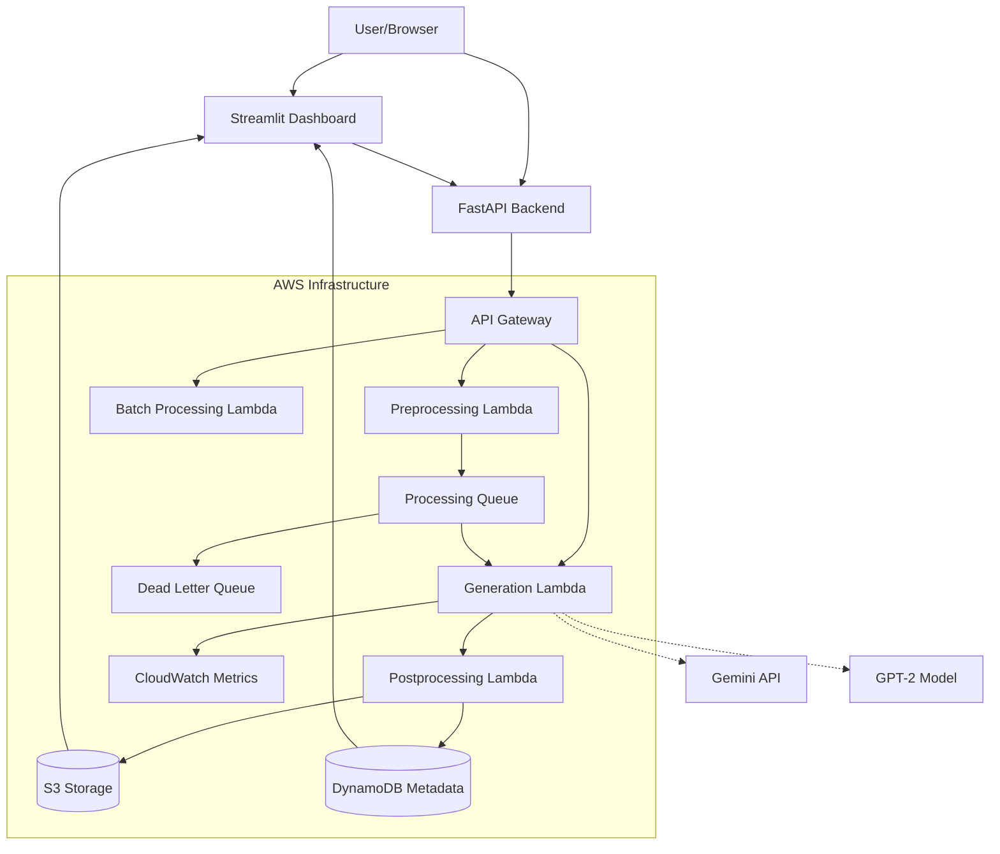
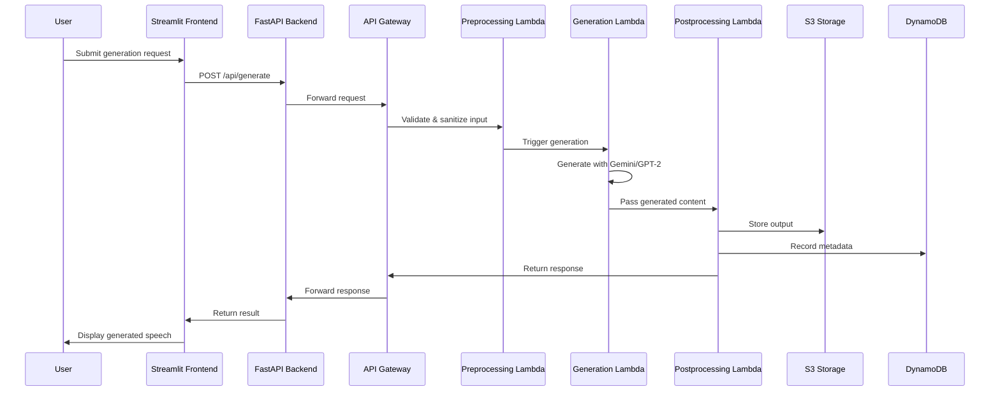

# AWS Lambda Processing Pipeline - Architecture Plan

## Project Overview

Transform the existing Anime Quote Generator into a production-grade AWS serverless pipeline with full API integration, frontend deployment system, and comprehensive documentation.

## Current State Analysis

- **Existing Code**: [`lambda/handler.py`](lambda/handler.py) (277 lines) - Single Lambda with 3 routes using CrewAI + Gemini
- **GPT-2 Model**: [`mainfiles/gen.py`](mainfiles/gen.py) (484 lines) - Fine-tuning and generation capabilities
- **Dataset**: [`mainfiles/data.txt`](mainfiles/data.txt) (342 quotes) - Training data
- **Empty Directories**: `docs/`, `frontend/`, `infrastructure/`, `scripts/` - Ready for new content

## Technology Stack Decisions

- **Infrastructure-as-Code**: AWS CDK (Python)
- **Frontend**: FastAPI backend + Streamlit dashboard
- **CI/CD**: GitHub Actions
- **AWS Region**: us-east-1
- **Database**: DynamoDB for execution metadata
- **Queue Service**: SQS for async processing
- **Storage**: S3 for data, models, and outputs
- **Monitoring**: CloudWatch for logging, metrics, and alarms

## System Architecture

### High-Level Architecture Diagram



### Data Flow Sequence



## Phase Breakdown

### Phase 1: AWS Lambda Architecture

**Objective**: Refactor monolithic handler into modular, scalable Lambda functions

1. **Refactor existing [`lambda/handler.py`](lambda/handler.py)** into separate modules:
   - `preprocessing.py` - Input validation, sanitization, parameter normalization
   - `generation.py` - Core generation logic (Gemini + GPT-2 + fallback)
   - `postprocessing.py` - Formatting, storage, metadata recording
   - `batch_processor.py` - SQS-triggered batch processing
   - `dead_letter_handler.py` - DLQ processing and alerting

2. **Implement error handling** with exponential backoff retry mechanisms
3. **Configure IAM roles** with least-privilege policies per function
4. **Set up CloudWatch** for centralized logging, custom metrics, and alarms

### Phase 2: API Gateway Integration

**Objective**: Create robust, secure API endpoints with proper request handling

1. **Design HTTP API** with routes:
   - `POST /generate` - Single speech generation
   - `POST /generate/batch` - Batch generation (async via SQS)
   - `GET /health` - Health check endpoint
   - `GET /status/{job_id}` - Job status retrieval
   - `GET /history` - Generation history

2. **Implement request validation** using API Gateway models
3. **Add rate limiting** and throttling configuration
4. **Configure CORS** for frontend access
5. **Add API keys** for authentication (optional JWT via Lambda authorizer)

### Phase 3: S3/SQS/SNS Integration

**Objective**: Build asynchronous processing pipeline with storage and notifications

1. **Design S3 bucket structure**:

   ```
   s3://anime-quote-generator/
   ├── inputs/           # Raw input data
   ├── outputs/          # Generated speeches
   ├── models/           # GPT-2 fine-tuned models
   └── logs/             # Processing logs
   ```

2. **Implement SQS queues**:
   - `generation-queue` - Primary processing queue
   - `generation-dlq` - Dead letter queue for failed messages
   - `notification-queue` - For SNS fanout

3. **Set up SNS topics** for notifications:
   - `generation-complete` - Success notifications
   - `generation-failed` - Error alerts

4. **Create DynamoDB tables**:
   - `GenerationJobs` - Job metadata and status
   - `UserHistory` - User generation history
   - `SystemMetrics` - Performance metrics

### Phase 4: FastAPI Backend Development

**Objective**: Build Python backend for frontend API and business logic

1. **Create FastAPI project structure**:

   ```
   backend/
   ├── app/
   │   ├── api/
   │   │   ├── v1/
   │   │   │   ├── endpoints/
   │   │   │   └── __init__.py
   │   │   └── __init__.py
   │   ├── core/
   │   │   ├── config.py
   │   │   └── security.py
   │   ├── models/
   │   │   └── schemas.py
   │   └── services/
   │       └── aws_client.py
   └── requirements.txt
   ```

2. **Implement API routes** that proxy to AWS API Gateway
3. **Add JWT authentication** with user management
4. **Implement WebSocket endpoints** for real-time job status updates
5. **Create configuration management** for AWS resource ARNs

### Phase 5: Streamlit Dashboard Development

**Objective**: Build user-friendly web interface for pipeline management

1. **Create multi-page Streamlit app**:

   ```
   frontend/
   ├── pages/
   │   ├── 01_🏠_Dashboard.py
   │   ├── 02_🎭_Generate.py
   │   ├── 03_📊_History.py
   │   ├── 04_⚙️_Configuration.py
   │   └── 05_📈_Monitoring.py
   ├── utils/
   │   ├── aws_client.py
   │   └── visualization.py
   └── app.py
   ```

2. **Build real-time monitoring dashboard** with:
   - Live Lambda invocation metrics
   - Queue depth visualization
   - Generation success/failure rates
   - Cost estimation display

3. **Implement generation controls**:
   - Speech type selection
   - Parameter tuning (temperature, length)
   - Character selection for dialogues
   - Batch generation configuration

4. **Add execution history view** with search and filtering
5. **Create AWS resource configuration UI** for managing endpoints and credentials

### Phase 6: AWS CDK Infrastructure (Python)

**Objective**: Define all AWS resources as code with environment-specific configurations

1. **Initialize CDK project**:

   ```
   infrastructure/
   ├── app.py
   ├── cdk.json
   ├── requirements.txt
   └── anime_quote_generator/
       ├── __init__.py
       ├── stack.py
       ├── constructs/
       │   ├── lambda_construct.py
       │   ├── api_gateway_construct.py
       │   └── storage_construct.py
       └── utils/
           └── config_loader.py
   ```

2. **Create reusable constructs**:
   - `LambdaConstruct` - Lambda functions with layers, environment, alarms
   - `ApiGatewayConstruct` - API Gateway with routes, models, authorizers
   - `StorageConstruct` - S3 buckets, DynamoDB tables, SQS queues
   - `MonitoringConstruct` - CloudWatch dashboards, alarms, metrics

3. **Implement environment-specific configs** (dev/staging/prod):
   - Different memory/timeout settings
   - Environment-specific S3 bucket names
   - VPC configuration for VPC-enabled Lambdas

4. **Create deployment scripts**:
   - `deploy-dev.sh` - Development deployment
   - `deploy-prod.sh` - Production deployment with approval
   - `destroy.sh` - Cleanup script

### Phase 7: CI/CD Pipeline with GitHub Actions

**Objective**: Automate testing, building, and deployment

1. **Create GitHub Actions workflows**:
   - `lambda-deploy.yml` - Lambda function deployment
   - `cdk-deploy.yml` - CDK infrastructure deployment
   - `frontend-deploy.yml` - Streamlit app deployment
   - `test-suite.yml` - Automated testing

2. **Implement environment promotion**:
   - Dev → Staging → Production
   - Manual approval gates for production
   - Automated rollback on deployment failure

3. **Add automated testing**:
   - Unit tests for Lambda functions
   - Integration tests for API endpoints
   - CDK construct tests
   - Load tests for concurrent execution

4. **Implement deployment validation**:
   - Post-deployment health checks
   - Smoke tests for critical paths
   - Performance baseline validation

### Phase 8: Testing Suite

**Objective**: Ensure reliability, performance, and security

1. **Unit tests** (pytest):
   - Test each Lambda function in isolation
   - Mock AWS services (boto3)
   - Test error handling and edge cases

2. **Integration tests**:
   - Test API Gateway + Lambda integration
   - Test S3 upload/download functionality
   - Test SQS message processing

3. **Load tests** (locust):
   - Simulate concurrent user requests
   - Measure response times under load
   - Identify bottlenecks and scaling limits

4. **CDK construct tests**:
   - Test that constructs create expected resources
   - Validate IAM policies and security configurations

### Phase 9: Documentation Package

**Objective**: Provide comprehensive documentation for users and developers

1. **Architecture documentation**:
   - System architecture diagrams
   - Data flow documentation
   - Component interaction diagrams

2. **Deployment guide**:
   - Prerequisites and setup instructions
   - Step-by-step deployment process
   - Environment configuration guide

3. **API reference**:
   - Endpoint specifications (OpenAPI/Swagger)
   - Request/response examples
   - Error code documentation

4. **User manual**:
   - Frontend usage guide with screenshots
   - Feature walkthroughs
   - Troubleshooting common issues

5. **Security and compliance**:
   - Security considerations
   - Compliance checklist (GDPR, HIPAA if applicable)
   - IAM policy recommendations

6. **Cost optimization**:
   - Cost estimation for different usage patterns
   - Monitoring and alerting for cost control
   - Optimization recommendations

### Phase 10: Future Enhancement Documentation

**Objective**: Document advanced features for future implementation

1. **Containerized Lambda functions**:
   - Docker container approach for GPT-2 dependencies
   - ECR integration and deployment

2. **Multi-region deployment**:
   - Active-active configuration
   - Global accelerator setup
   - Data replication strategy

3. **Blue-green deployment**:
   - Traffic shifting strategies
   - Rollback procedures
   - Canary deployment patterns

4. **Advanced AWS integrations**:
   - Step Functions for workflow orchestration
   - EventBridge for event-driven architecture
   - X-Ray for distributed tracing

5. **Custom metrics and alerting**:
   - Business-specific metrics
   - Anomaly detection
   - Automated remediation

## Security Considerations

### IAM Least Privilege

- Separate IAM roles per Lambda function
- Resource-level permissions (specific S3 buckets, DynamoDB tables)
- No wildcard permissions in production

### Data Protection

- Encrypt S3 buckets with SSE-S3 or SSE-KMS
- Encrypt DynamoDB tables at rest
- Use HTTPS for all API communications

### Authentication & Authorization

- API Gateway API keys for basic protection
- Optional JWT tokens for user-level authorization
- Lambda authorizers for custom authentication logic

### Monitoring & Auditing

- CloudTrail enabled for all API calls
- Regular security audit logs review
- Automated security scanning in CI/CD

## Cost Optimization Strategy

### Lambda Optimization

- Right-size memory allocation (128MB - 3008MB)
- Implement provisioned concurrency for predictable workloads
- Use ARM architecture for cost savings

### Storage Optimization

- S3 lifecycle policies for old data
- DynamoDB auto-scaling with appropriate capacity units
- Regular cleanup of temporary files

### Monitoring Costs

- CloudWatch custom metrics sampling
- Log retention policies (30 days default)
- Cost allocation tags for resource tracking

## Risk Mitigation

### Single Points of Failure

- Implement multi-AZ for DynamoDB
- Configure S3 cross-region replication for critical data
- Use multiple SQS queues with DLQ for message processing

### Scaling Limitations

- Set appropriate concurrency limits
- Implement queue-based backpressure
- Monitor and adjust DynamoDB capacity

### Dependency Risks

- Fallback mechanisms for external APIs (Gemini)
- Local model caching for GPT-2
- Circuit breaker pattern for external service calls

## Success Metrics

### Performance Metrics

- P99 latency < 2 seconds for single generation
- Batch processing throughput > 100 jobs/minute
- Availability > 99.9%

### Quality Metrics

- Generation success rate > 95%
- User satisfaction score (post-implementation survey)
- Mean time to recovery (MTTR) < 15 minutes

### Cost Metrics

- Cost per 1000 generations < $5
- Infrastructure cost growth < usage growth
- Optimization savings > 20% quarter-over-quarter

## Next Steps

1. **Review and approve** this architecture plan
2. **Begin implementation** with Phase 1 (AWS Lambda Architecture)
3. **Set up development environment** with CDK and local testing
4. **Establish CI/CD pipeline** early for automated testing

## Deliverables Checklist

- [ ] Fully functional Lambda processing system with API endpoints
- [ ] Production-ready frontend application with deployment scripts
- [ ] Complete documentation suite in Markdown/PDF format
- [ ] One-click deployment scripts for all environments
- [ ] Testing suite with unit, integration, and load tests
- [ ] Security audit report and compliance checklist

---

_Last Updated: 2026-04-30_  
_Architect: Roo_  
_Project: Anime Quote Generator AWS Pipeline_
